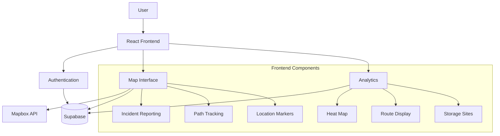
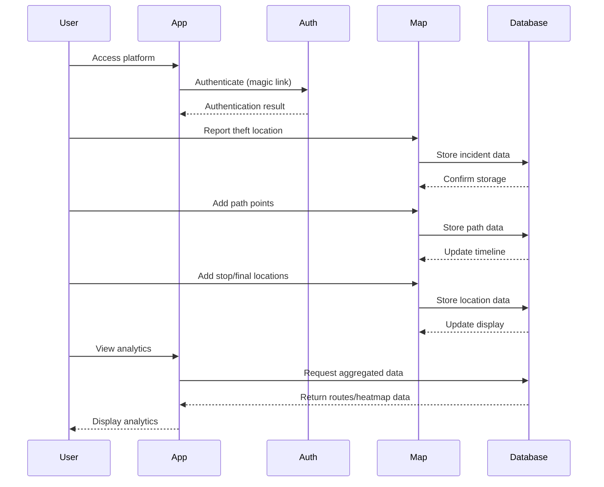
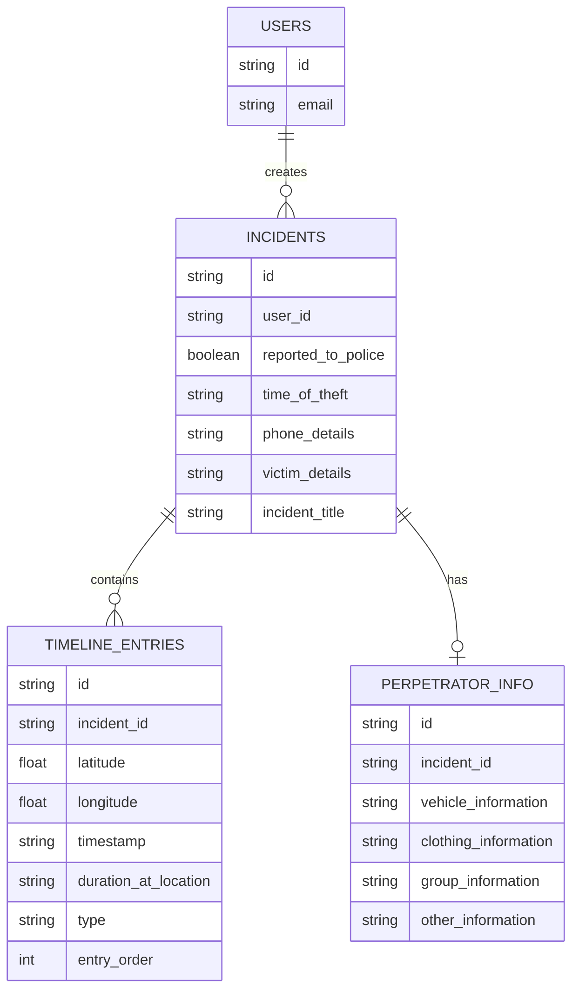

# snatchback.London

A platform for tracking and helping police recover stolen phones in London by plotting the routes they take.

## Overview

snatchback.London is a community-driven platform designed to address the growing problem of phone theft in London. The platform allows users to manually plot location data from stolen devices to crowdsource intelligence on:

- Where phones are being stolen
- The routes they take after theft
- Where they're being temporarily stored
- Where they ultimately end up

By aggregating this data, snatchback.London creates a comprehensive picture of phone theft patterns across London, helping to put law enforcement on the front foot in tackling this issue.

### Mission

Our mission is to empower victims of phone theft by giving them a way to contribute to a larger dataset that can help identify patterns, hotspots, and storage locations. This crowdsourced intelligence can then be used by police and emergency services to focus their efforts more effectively.

### Key Features

- **Theft Incident Reporting**: Report details of phone theft incidents including location, time, and device information
- **Path Tracking**: Plot the route your stolen phone took based on tracking data
- **Stop Location Marking**: Identify locations where the stolen phone remained stationary
- **Final Location Marking**: Record where the phone's tracking ended
- **Perpetrator Information**: Document details about the thieves when available
- **Analytics Dashboard**: View aggregated data showing theft hotspots, common routes, and potential storage locations
- **Secure Authentication**: User authentication via magic links for enhanced security

## Architecture

### System Architecture



### Technology Stack

- **Frontend**: React 18 with TypeScript
- **Build Tool**: Vite
- **UI Libraries**: 
  - Mantine for UI components
  - Tailwind CSS for styling
  - FontAwesome for icons
- **Mapping**: 
  - Mapbox GL for map rendering
  - React Map GL for React integration
- **Authentication & Database**: Supabase
- **Routing**: React Router
- **State Management**: React Context API

### Key Components

- **Authentication System**: Magic link authentication via Supabase
- **Map Interface**: Interactive Mapbox-based interface for plotting theft data
- **Analytics Dashboard**: Visualization of aggregated theft data
- **Context Providers**: Global state management for authentication and incidents

## Data Flow

### User Journey



### Data Model



### Data Processing Flow

1. **Incident Creation**: 
   - User reports a theft incident
   - System creates an incident record and initial theft location entry
   - User is assigned as the owner of the incident

2. **Timeline Building**:
   - User adds path points, stop locations, and final location
   - Each point is stored as a timeline entry with type, coordinates, and timestamp
   - Points are ordered sequentially to maintain the timeline integrity

3. **Analytics Generation**:
   - System aggregates data from all incidents
   - Generates heatmaps of theft locations
   - Identifies common routes and potential storage sites
   - Presents visualizations in the analytics dashboard

## Code Structure

### Directory Structure

```
/
├── public/               # Static assets
├── src/                  # Source code
│   ├── components/       # React components
│   │   └── landing/      # Landing page components
│   ├── contexts/         # React context providers
│   ├── lib/              # Library code and utilities
│   ├── pages/            # Page components
│   ├── services/         # API services
│   └── types/            # TypeScript type definitions
├── index.html            # Entry HTML file
├── vite.config.ts        # Vite configuration
└── tsconfig.json         # TypeScript configuration
```

### Key Files and Their Purposes

- **src/App.tsx**: Main application component with routing setup
- **src/contexts/AuthContext.tsx**: Authentication state management
- **src/contexts/IncidentContext.tsx**: Current incident state management
- **src/components/Map.tsx**: Main map interface for incident reporting
- **src/components/Analytics.tsx**: Analytics dashboard
- **src/services/theftService.ts**: API functions for theft incident data
- **src/services/routeService.ts**: API functions for route data
- **src/types/theft.ts**: Type definitions for theft-related data
- **src/types/route.ts**: Type definitions for route-related data

### Component Relationships

The application is structured around several key components:

1. **Context Providers**:
   - `AuthProvider`: Manages user authentication state
   - `IncidentProvider`: Manages the current incident being viewed or edited

2. **Page Components**:
   - `LandingPage`: Public landing page with information about the platform
   - `LoginPage`: Authentication page
   - `Map`: Main interface for reporting and viewing incidents
   - `Analytics`: Dashboard for viewing aggregated data

3. **Functional Components**:
   - `MapToolbar`: Controls for interacting with the map
   - `LocationSearch`: Search functionality for finding locations
   - `PathDrawer`: Interface for drawing paths on the map
   - `TheftDetailsDialog`: Form for entering theft details
   - `PerpetratorInformationDialog`: Form for entering perpetrator information

## Features

### Authentication

The platform uses Supabase's magic link authentication for secure, passwordless login:

1. Users enter their email address
2. They receive a magic link via email
3. Clicking the link authenticates them without requiring a password

This approach enhances security while simplifying the user experience.

### Incident Reporting

Users can report phone theft incidents by:

1. Clicking "Add Theft Location" on the map
2. Placing a marker at the theft location
3. Entering details about the theft:
   - Time of theft
   - Phone details
   - Victim information
   - Whether it was reported to police

### Path Tracking

After reporting an initial theft, users can track the path of their stolen phone:

1. Activate path drawing mode
2. Select a starting point (usually the theft location)
3. Click on the map to add path points
4. Press Enter to complete the path

The system connects these points to visualize the route the stolen phone took.

### Stop and Final Locations

Users can mark:

- **Stop Locations**: Places where the phone remained stationary for a period
- **Final Locations**: The last known location of the phone

For each location, users can provide timestamps and additional details.

### Perpetrator Information

When available, users can add information about the perpetrators:

- Vehicle information
- Clothing description
- Group details
- Other relevant information

This data can help identify patterns across multiple incidents.

### Analytics

The analytics dashboard provides:

1. **Theft Heatmap**: Visualization of theft hotspots across London
2. **Route Display**: Common routes taken by stolen phones
3. **Storage Sites**: Potential locations where stolen phones are being stored

This aggregated data helps identify patterns and focus areas for intervention.

## Development

### Setup Instructions

1. Clone the repository:
   ```bash
   git clone https://github.com/your-org/london-disrupt.git
   cd london-disrupt
   ```

2. Install dependencies:
   ```bash
   npm install
   ```

3. Set up environment variables:
   Create a `.env` file with the following variables:
   ```
   VITE_SUPABASE_URL=your_supabase_url
   VITE_SUPABASE_ANON_KEY=your_supabase_anon_key
   VITE_MAPBOX_TOKEN=your_mapbox_token
   ```

4. Start the development server:
   ```bash
   npm run dev
   ```

### Environment Variables

- `VITE_SUPABASE_URL`: URL of your Supabase project
- `VITE_SUPABASE_ANON_KEY`: Anonymous key for Supabase authentication
- `VITE_MAPBOX_TOKEN`: API token for Mapbox

### Database Setup

The application requires the following tables in Supabase:

1. `phone_theft_incidents`: Stores incident reports
2. `phone_theft_timeline_entries`: Stores timeline entries (theft, path, stop, final locations)
3. `perpetrator_information`: Stores information about perpetrators
4. `aggregated_theft_routes`: View or table for analytics data

### Building for Production

```bash
npm run build
```

This will generate optimized production files in the `dist` directory.

### Deployment

The application is configured for deployment on Vercel:

1. Connect your repository to Vercel
2. Configure environment variables
3. Deploy

## Contributing

Contributions to snatchback.London are welcome! Please follow these guidelines:

### Code Standards

- Follow the existing code style
- Write clean, readable, and well-documented code
- Include appropriate TypeScript types
- Test your changes thoroughly

### Pull Request Process

1. Fork the repository
2. Create a feature branch
3. Make your changes
4. Submit a pull request with a clear description of the changes

## License

This project is licensed under the MIT License - see the LICENSE file for details.

## About

snatchback.London was built out of frustration at the growing problem of phone theft in London. The platform aims to empower victims and help law enforcement by providing better data on theft patterns and hotspots.

The platform will remain free for everyone, forever.
